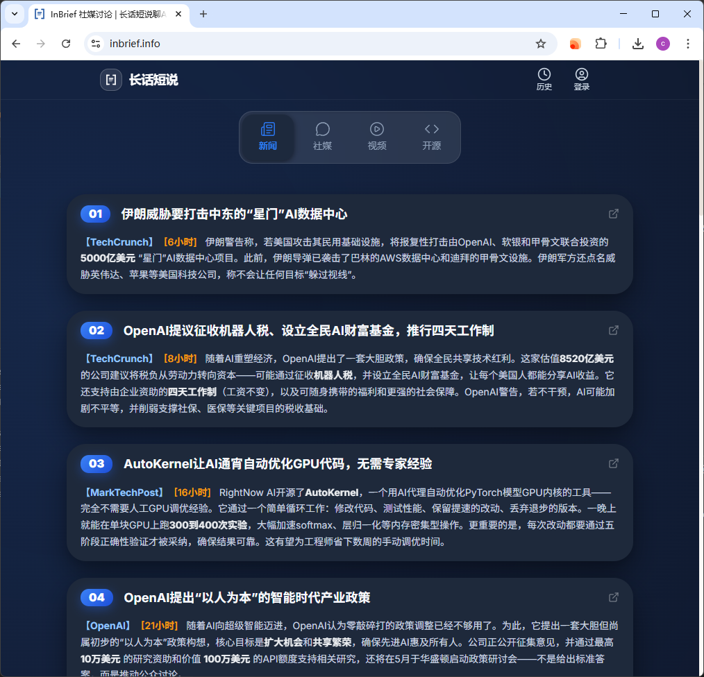
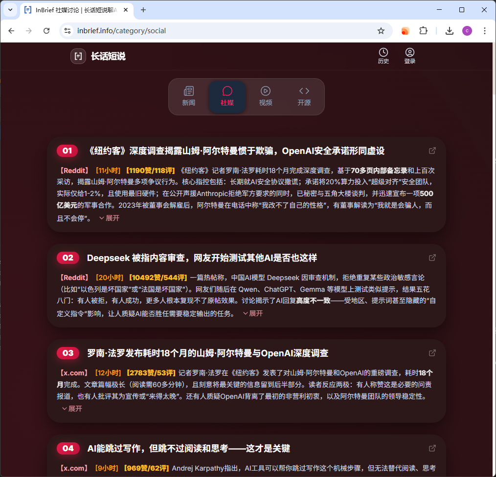
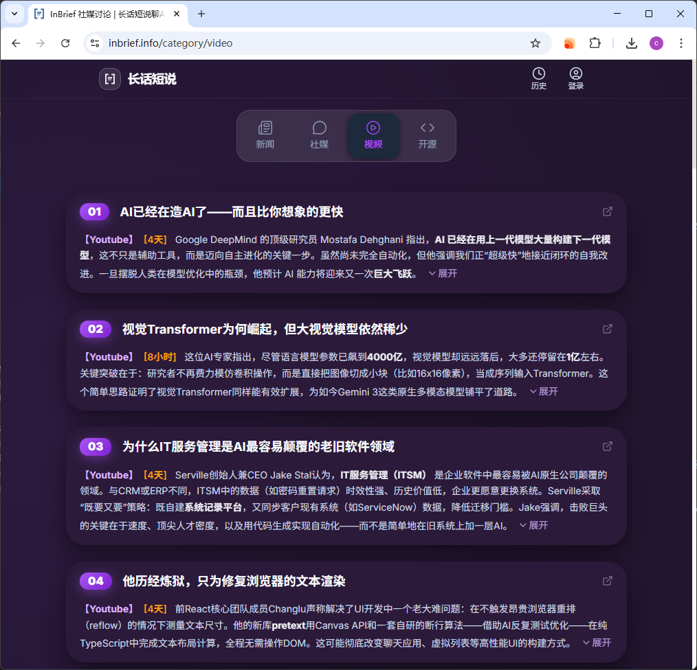
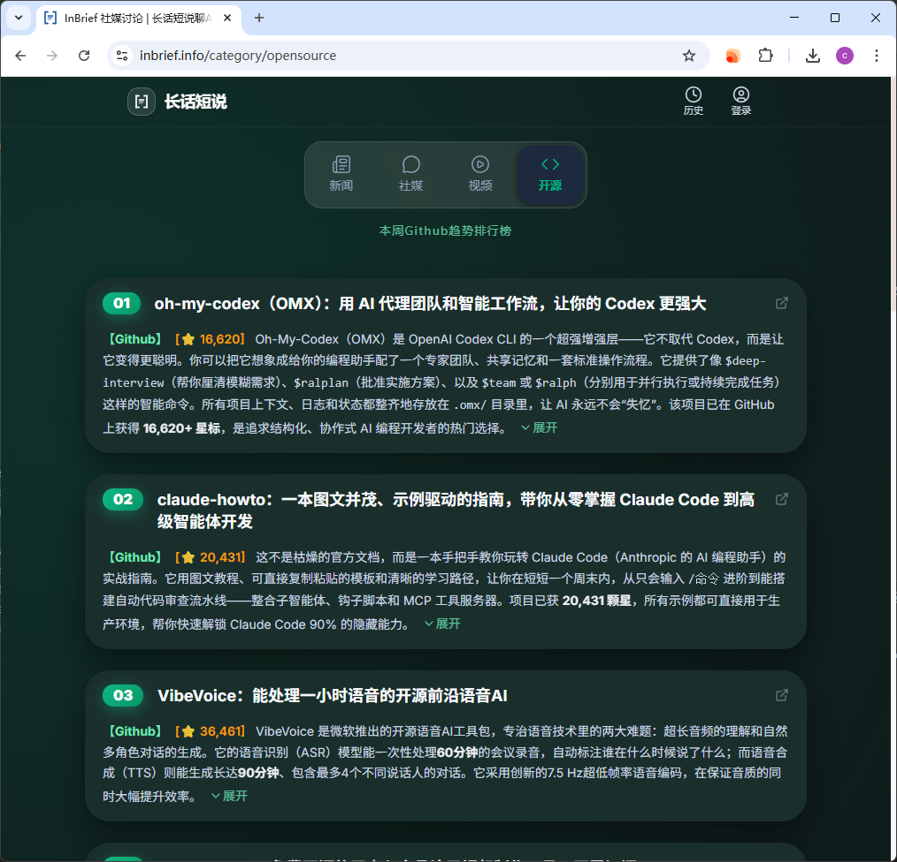

# AI News Skill

[](https://github.com/frankzch/ai-news-skill/blob/main/LICENSE)
[](https://agentskills.io/)

[English](./README.en.md) | [中文](./README.md)

---

这是一个可以获取实时、全面、深度过滤的一手AI信息的Agent skill。**完全免费，开箱即用，不需要任何 API Key，也不需要自己抓取数据**。

📊 目前已聚合 **75 个 AI 信息源**（持续增加中，欢迎提供更多信息源地址），涵盖：
- **15 个新闻资讯源** — 覆盖 TechReview、TheVerge AI、Venturebeat、artificialintelligence-news、TechCrunch、Machine Learning Mastery、MarkTechPost 等主流 AI/ML 行业媒体，以及 Nvidia Blog、Apple AI、Microsoft Blog、Google Deepmind Blog、OpenAI、Google Research Blog 等 AI 大厂官方博客
- **46 个社交媒体** — 包含 Reddit、X、HackerNews 等主流社交媒体，热点板块、热点关键字、大 V 社媒账号。X 上的 KOL 包括：Andrej Karpathy、Sam Altman、Peter Steinberger、Aditya Agarwal、Dan Shipper、Nikunj Kothari、Ryo Lu、Matt Turck、Aaron Levie、Alex Albert、Guillermo Rauch、Amjad Masad、Amanda Askell、Madhu Guru、Kevin Weil 等
- **13 个大 V 视频博主** — YouTube 顶尖 AI 创作者，包括：Matt Wolfe、Dwarkesh Patel、DataDrivenNYC、Latent Space、Sequoia Capital、Yannic Kilcher、NoPriorsPodcast、RedpointAI、EveryInc、Fireship、Lex Fridman、Wes Roth 等
- **GitHub 开源趋势榜** — 每周热门 AI 仓库

> 🔄 所有信息源每 **3 小时** 自动更新一次

### 🌟 数据抓取由 InBrief.info 驱动
此 Agent Skill背后的全网AI信息数据处理由 **[InBrief.info](https://inbrief.info)** 免费驱动。如果你只想直接通过网页查阅最新、最优质的 AI 资讯，强烈推荐直接访问 **[InBrief.info](https://inbrief.info)** 获取个性化的专属简报，无需折腾任何 Agent！

> 🔑 **注册账户，获取更多返回结果**
> 按每次调用返回的条数分三档：
> - **未配置 / 无效 API Key**（访客）：每次最多返回 **3 条**
> - **已登录非会员**：每次最多返回 **6 条**
> - **会员**：每次最多返回 **100 条**
>
> 解锁步骤：
> 1. 前往 **[InBrief.info](https://inbrief.info)** 免费注册账户
> 2. 进入 **设置页 → PulseAI Agent Skill**，复制你的 API Key
> 3. 将 Key 粘贴到 skill 根目录下的 `config.yaml`（可从 [`assets/config.default.yaml`](./assets/config.default.yaml) 复制模板）的 `api_key` 字段

<p align="center">
  
  
</p>
<p align="center">
  
  
</p>

### ⚡ 快速开始
在你的 AI agent 中安装此 skill（支持 OpenClaw, Claude Code, Antigravity, Codex）

**OpenClaw**
```bash
# 目前为手动安装，后期会提交到 ClawHub
git clone https://github.com/frankzch/ai-news-skill.git ~/skills/ai-news-skill
```

**Claude Code**
```bash
git clone https://github.com/frankzch/ai-news-skill.git ~/.claude/skills/ai-news-skill
```

**Antigravity Agent**
```bash
git clone https://github.com/frankzch/ai-news-skill.git ~/.agents/skills/ai-news-skill
```

**Codex**
```bash
git clone https://github.com/frankzch/ai-news-skill.git ~/.codex/skills/ai-news-skill
```

### 🎛️ 修改设置与过滤
无需配置繁琐的参数，直接在对话中控制你的 Agent。例如：
- "最近5天有哪些大V发布的AI视频"
- "给我看看今天的AI新闻，但排除 TechReview 平台的"
- "获取过去 3天的 Reddit上关于AI的讨论"

Agent 会自动理解你的需求并转化为精确的过滤条件。你可以控制的维度包括：

- 📂 **按分类筛选** — 指定只看或排除某类内容：新闻资讯、开源项目、社交讨论、KOL 观点
- 📡 **按来源筛选** — 指定只看或排除特定平台（如 Reddit、TechCrunch等）
- ⏰ **时间范围** — 自定义获取过去多少小时的内容（默认 24 小时）
- 🔢 **数量限制** — 控制返回的条目数量（实际上限受会员等级约束：访客 3 / 已登录 6 / 会员 100）
- 📝 **摘要显示** — 选择是否显示短摘要、长摘要
- 🔗 **链接显示** — 选择是否显示原文链接
- 🌐 **输出语言** — 选择输出语言（英文或中文），默认跟随系统语言，若系统语言非中英文则回退为英文
- 💾 **输出方式** — 结果可直接打印到终端，也可导出为 JSON 文件

### 🔧 AgentSkills 标准兼容
本 Skill 遵循 [AgentSkills](https://agentskills.io/) 开放标准。`SKILL.md` 文件包含所有元数据和指令，任何兼容的 Agent 都可以自动发现、激活和执行此 Skill。

### 🤝 参与贡献
欢迎贡献代码！请查看 [CONTRIBUTING.md](./CONTRIBUTING.md) 了解贡献指南。

### 📄 开源协议
本项目采用 [MIT 协议](./LICENSE) 开源。
